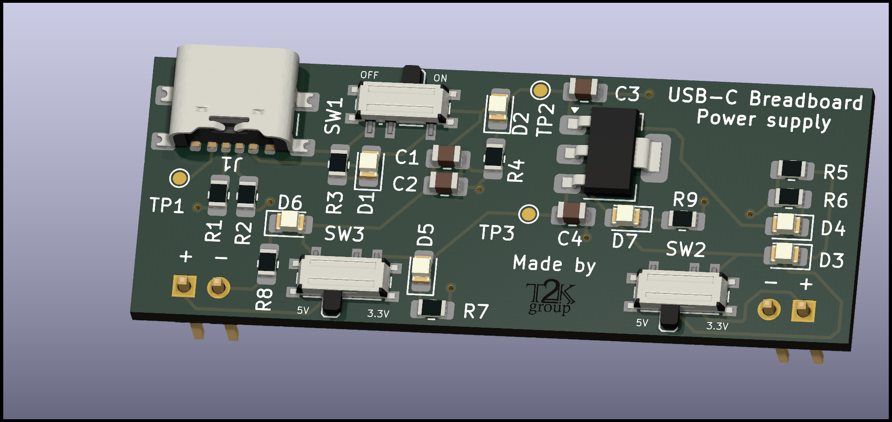

# USB-C Breadboard Power Supply

Introducing a sleek USB-C breadboard power supply designed to modernize and streamline your electronics projects. Say goodbye to the cumbersome 9V batteries and DC barrel jacks. This board brings convenience and efficiency to your workbench.

## Key Features:

- Dual Voltage Output: Easily select between 5V and 3.3V outputs to accommodate a variety of components and circuits.
- Breadboard-Friendly Design: Perfectly fits a 840-pin breadboard, enabling a secure and stable connection.
- Independent Side Outputs: Manage different voltage needs on each side of your breadboard with independent switchable outputs.

## Ordering infomation

All Production files can be found in the `Production` folder. The Gerber files are named `usbcpower.zip` and the bill of materials is named `bom.csv`. The board is designed to be manufactured with 1.6mm FR4 and ENIG finish. The board is designed to be assembled with 0805 SMD components.

The BOM cost for this project is approximately £7.80 [see Digikey List](https://www.digikey.co.uk/en/mylists/list/3C8NIB07NC), It is possible to reduce this cost by using parts from other suppliers (LCSC etc.)

> Please inspect your boards for quality and always test your boards before use. If you have any issues with the boards, please contact us at `opensource at t2k dot group`.

## Enhance Your Projects

Our USB-C power supply is not just compact and user-friendly, but also a step towards modernising your electronic designs. Its easy-to-use interface is designed for hobbyists and professionals alike, making it a must-have tool for any electronics kit.
Open Source Commitment

## Designed for Beginners and Professionals

All components are 0805 SMD with hand soldering pads, This makes it possible to assemble the devices at home with a soldering iron and a steady hand. The board is designed to be easy to assemble and use, making it a great learning tool for beginners and a convenient tool for professionals.

## Open Source Commitment

While this project is proudly open source, please note that the "T2K Group" logo on the PCB is a copyright of T2K Group Limited and must remain unaltered. However, you are free to remove it from the board completely if you wish to do so.

This board was designed by [J.Fitton](https://github.com/jackfitton112/) for T2K Group Limited. If you have any questions or feedback, please feel free to reach out to us at `opensource at t2k dot group`.